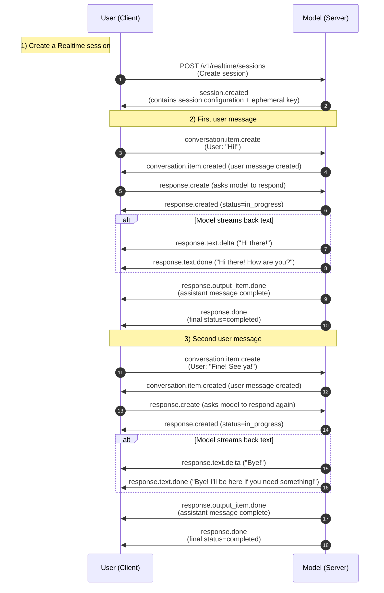
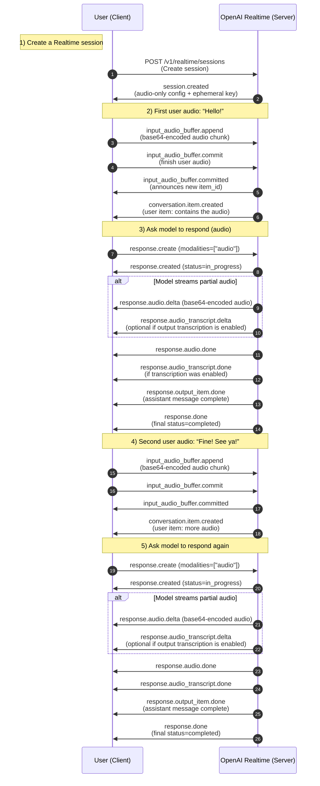
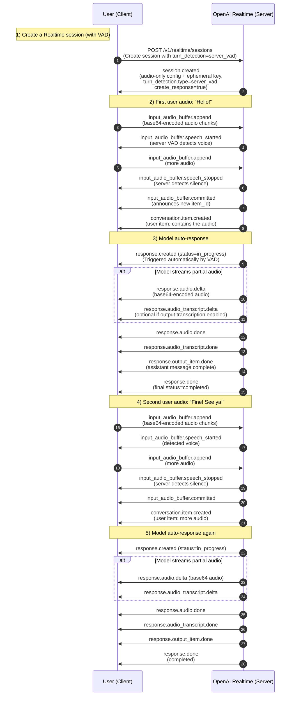

# **OpenAI Realtime** (Beta)

This documents the events and the sequence of events available for use when communicating with OpenAI Realtime.

Below there are some sequence diagrams illustrating the necessary events (client and server sided) for a simple conversation like the following:

- **User**: "Hi!"
- **Model**: "Hi there! How are you?"
- **User**: "Fine! See ya!"
- **Model**: "Bye! I'll be here if you need something!"

## Text-only messages



## Audio-only messages (VAD disabled)


## Audio-only messages (VAD on)


Below is a **side-by-side comparison** of how a conversation flow differs between **Text-Only** and **Audio-Only** modes, and how **VAD (Voice Activity Detection)** changes the flow of audio. We compare these scenarios from **session creation** up to the point where the **model’s response arrives**.

## 1. **Session Creation**

### **Text-Only**  
- **Modalities**: `["text"]`  
- You typically configure just the model, temperature, instructions, etc. No audio fields are needed.  
- The server emits `session.created` with text-based defaults (e.g., no `input_audio_format`, `voice`, or `turn_detection`).

### **Audio-Only, VAD Off**  
- **Modalities**: `["audio"]`  
- You might set `input_audio_format`, `output_audio_format`, `voice`, etc.  
- **turn_detection** is `null` or omitted.  
- The server emits `session.created` reflecting an audio-only configuration without VAD.

### **Audio-Only, VAD On**  
- **Modalities**: `["audio"]`  
- You provide `turn_detection={ type: "server_vad", ... }` to enable server-side voice detection.  
- The server emits `session.created` showing VAD is enabled (e.g., `turn_detection.type=server_vad`).

---

## 2. **User Message Sending**

### **Text-Only**
1. **User sends message**  
   - The client uses `conversation.item.create` with `type="message"`, `role="user"`, `content=[ { "type": "input_text", "text": "...user text..." } ]`.  
   - The server responds with `conversation.item.created`, acknowledging the new user message item.

2. **(Optional) Request a response**  
   - Client calls `response.create` to make the model generate an assistant message.  
   - The server emits `response.created`, followed by streaming text events (`response.text.delta`, `response.text.done`).

### **Audio-Only, VAD Off**
1. **User sends audio**  
   - The client repeatedly calls `input_audio_buffer.append` with base64-encoded audio chunks.  
   - When the user is done speaking, the client **manually** sends `input_audio_buffer.commit`.  
   - The server then responds with `input_audio_buffer.committed` and a `conversation.item.created` event (indicating the user’s audio message was added).

2. **(Optional) Request a response**  
   - Same as text: call `response.create`.  
   - The server streams back audio with `response.audio.delta` and eventually `response.audio.done`.

### **Audio-Only, VAD On**
1. **User sends audio**  
   - The client simply calls `input_audio_buffer.append` with base64 audio.  
   - **Server VAD** automatically detects speech start (`input_audio_buffer.speech_started`) and speech stop (`input_audio_buffer.speech_stopped`).  
   - When the server detects silence, it **automatically commits** the buffer—no client commit is needed. The server sends `input_audio_buffer.committed` and `conversation.item.created`.

2. **(Optional) Automatic response**  
   - If `turn_detection.create_response=true` in the session config, the server **automatically** calls `response.create` after committing the user message.  
   - The server streams back audio with `response.audio.delta` until done.

---

## 3. **Model Response Arrival**

### **Text-Only**  
- After the client sends `response.create`, you get:  
  1. `response.created` (acknowledges the new response is in progress)  
  2. `response.text.delta` events (partial text)  
  3. `response.text.done` for the final chunk of text  
  4. `response.output_item.done` (assistant message complete)  
  5. `response.done` (wraps up the entire response)

### **Audio-Only, VAD Off**  
- After `response.create`, you get:  
  1. `response.created`  
  2. Multiple `response.audio.delta` events, each carrying **base64-encoded audio**  
  3. (Optional) `response.audio_transcript.delta/done` if **output transcription** is enabled  
  4. `response.audio.done` indicating no more audio  
  5. `response.output_item.done`  
  6. `response.done`

### **Audio-Only, VAD On**  
- Very similar to **VAD Off** for receiving audio data. The difference is in **how** the user message was committed:
  - The server automatically triggers the next response if `create_response=true`.  
  - Otherwise, the client can still call `response.create` manually.  
- You still receive:
  1. `response.created`  
  2. `response.audio.delta` (audio streaming)  
  3. (Optional) `response.audio_transcript.delta/done`  
  4. `response.audio.done`  
  5. `response.output_item.done`  
  6. `response.done`

---

## Official OpenAI events documentation

Communicate with a GPT-4o class model in real time using WebRTC or WebSockets. Supports text and audio inputs and outputs, along with audio transcriptions.

## **Session tokens**

REST API endpoint to generate ephemeral session tokens for use in client-side applications.

## **Create session**

`post https://api.openai.com/v1/realtime/sessions`

Create an ephemeral API token for use in client-side applications with the Realtime API. Can be configured with the same session parameters as the `session.update` client event.

It responds with a session object, plus a `client_secret` key which contains a usable ephemeral API token that can be used to authenticate browser clients for the Realtime API.

### **Request body**

| Field                        | Type                 | Required | Description                                                                                                                                                                                                                                                                                                                                                        |
| ---------------------------- | -------------------- | -------- | ------------------------------------------------------------------------------------------------------------------------------------------------------------------------------------------------------------------------------------------------------------------------------------------------------------------------------------------------------------------ |
| **modalities**               | array of strings     | Optional | The set of modalities the model can respond with. To disable audio, set this to `["text"]`.                                                                                                                                                                                                                                                                          |
| **model**                    | string               | Required | The Realtime model used for this session.                                                                                                                                                                                                                                                                                                                          |
| **instructions**             | string               | Optional | The default system instructions (i.e., system message) prepended to model calls. This field allows the client to guide the model on desired responses. The model can be instructed on response content and format, (e.g. "be extremely succinct", "act friendly", "here are examples of good responses") and on audio behavior (e.g. "talk quickly", "inject emotion into your voice", "laugh frequently"). The instructions are not guaranteed to be followed by the model, but they provide guidance to the model on the desired behavior. Note that the server sets default instructions which will be used if this field is not set and are visible in the `session.created` event at the start of the session.                                           |
| **voice**                    | string               | Optional | The voice the model uses to respond. Voice cannot be changed during the session once the model has responded with audio at least once. Current voice options are `alloy`, `ash`, `ballad`, `coral`, `echo` `sage`, `shimmer` and `verse`.                                                                                                                                  |
| **input_audio_format**       | string               | Optional | The format of input audio. Options are `pcm16`, `g711_ulaw`, or `g711_alaw`.                                                                                                                                                                                                                                                                                  |
| **output_audio_format**      | string               | Optional | The format of output audio. Options are `pcm16`, `g711_ulaw`, or `g711_alaw`.                                                                                                                                                                                                                                                                                 |
| **input_audio_transcription** | object or null       | Optional | Configuration for input audio transcription, defaults to off and can be set to `null` to turn off once on. Input audio transcription is not native to the model, since the model consumes audio directly. Transcription runs asynchronously through Whisper and should be treated as rough guidance rather than the representation understood by the model. |
| **turn_detection**           | object or null       | Optional | Configuration for turn detection. Can be set to `null` to turn off. Server VAD means that the model will detect the start and end of speech based on audio volume and respond at the end of user speech.                                                                                                                                                              |
| **tools**                    | array                | Optional | Tools (functions) available to the model.                                                                                                                                                                                                                                                                                                                          |
| **tool_choice**              | string               | Optional | How the model chooses tools. Options are `auto`, `none`, `required`, or specify a function.                                                                                                                                                                                                                                                                           |
| **temperature**              | number               | Optional | Sampling temperature for the model, limited to \[0.6, 1.2]. Defaults to 0.8.                                                                                                                                                                                                                                                                                          |
| **max_response_output_tokens** | integer or "inf"     | Optional | Maximum number of output tokens for a single assistant response, inclusive of tool calls. Provide an integer between 1 and 4096 to limit output tokens, or `inf` for the maximum available tokens for a given model. Defaults to `inf`.                                                                                                                                |

### **input_audio_transcription Object**

| Field     | Type   | Optional | Description                                                          |
| --------- | ------ | -------- | -------------------------------------------------------------------- |
| **model** | string | Optional | The model to use for transcription, `whisper-1` is the only currently supported model. |

### **turn_detection Object**

| Field                 | Type    | Optional | Description                                                                                                                                              |
| --------------------- | ------- | -------- | -------------------------------------------------------------------------------------------------------------------------------------------------------- |
| **type**              | string  | Optional | Type of turn detection, only `server_vad` is currently supported.                                                                                     |
| **threshold**         | number  | Optional | Activation threshold for VAD (0.0 to 1.0), this defaults to 0.5. A higher threshold will require louder audio to activate the model, and thus might perform better in noisy environments. |
| **prefix_padding_ms** | integer | Optional | Amount of audio to include before the VAD detected speech (in milliseconds). Defaults to 300ms.                                                        |
| **silence_duration_ms**| integer | Optional | Duration of silence to detect speech stop (in milliseconds). Defaults to 500ms. With shorter values the model will respond more quickly, but may jump in on short pauses from the user.               |
| **create_response**   | boolean | Optional | Whether or not to automatically generate a response when VAD is enabled. `true` by default.                                                                       |

### **tools Array of Objects**

| Field         | Type   | Optional | Description                                                                                                            |
| ------------- | ------ | -------- | ---------------------------------------------------------------------------------------------------------------------- |
| **type**      | string | Optional | The type of the tool, i.e. `function`.                                                                              |
| **name**      | string | Optional | The name of the function.                                                                                              |
| **description** | string | Optional | The description of the function, including guidance on when and how to call it, and guidance about what to tell the user when calling (if anything). |
| **parameters**  | object | Optional | Parameters of the function in JSON Schema.                                                                           |

### **Returns**

The created Realtime session object, plus an ephemeral key

### **Example request**

```curl
curl -X POST https://api.openai.com/v1/realtime/sessions \
  -H "Authorization: Bearer $OPENAI_API_KEY" \
  -H "Content-Type: application/json" \
  -d '{
    "model": "gpt-4o-realtime-preview-2024-12-17",
    "modalities": ["audio", "text"],
    "instructions": "You are a friendly assistant."
  }'
```

### **Response**

```json
{
  "id": "sess_001",
  "object": "realtime.session",
  "model": "gpt-4o-realtime-preview-2024-12-17",
  "modalities": ["audio", "text"],
  "instructions": "You are a friendly assistant.",
  "voice": "alloy",
  "input_audio_format": "pcm16",
  "output_audio_format": "pcm16",
  "input_audio_transcription": {
      "model": "whisper-1"
  },
  "turn_detection": null,
  "tools": [],
  "tool_choice": "none",
  "temperature": 0.7,
  "max_response_output_tokens": 200,
  "client_secret": {
    "value": "ek_abc123", 
    "expires_at": 1234567890
  }
}
```

## **The session object**

A new Realtime session configuration, with an ephemeral key. Default TTL for keys is one minute.

| Field                        | Type                 | Description                                                                                                                                                                                                                                                                                                                            |
| ---------------------------- | -------------------- | -------------------------------------------------------------------------------------------------------------------------------------------------------------------------------------------------------------------------------------------------------------------------------------------------------------------------------------- |
| **client_secret**            | object               | Ephemeral key returned by the API.                                                                                                                                                                                                                                                                                                     |
| **modalities**               | array of strings     | The set of modalities the model can respond with. To disable audio, set this to `["text"]`.                                                                                                                                                                                                                                            |
| **instructions**             | string               | The default system instructions (i.e. system message) prepended to model calls. This field allows the client to guide the model on desired responses. The model can be instructed on response content and format, (e.g. "be extremely succinct", "act friendly", "here are examples of good responses") and on audio behavior (e.g. "talk quickly", "inject emotion into your voice", "laugh frequently"). The instructions are not guaranteed to be followed by the model, but they provide guidance to the model on the desired behavior. Note that the server sets default instructions which will be used if this field is not set and are visible in the `session.created` event at the start of the session.                                           |
| **voice**                    | string               | The voice the model uses to respond. Voice cannot be changed during the session once the model has responded with audio at least once. Current voice options are `alloy`, `ash`, `ballad`, `coral`, `echo` `sage`, `shimmer` and `verse`.                                                                                                   |
| **input_audio_format**       | string               | The format of input audio. Options are `pcm16`, `g711_ulaw`, or `g711_alaw`.                                                                                                                                                                                                                                                           |
| **output_audio_format**      | string               | The format of output audio. Options are `pcm16`, `g711_ulaw`, or `g711_alaw`.                                                                                                                                                                                                                                                          |
| **input_audio_transcription** | object or null       | Configuration for input audio transcription, defaults to off and can be set to `null` to turn off once on. Input audio transcription is not native to the model, since the model consumes audio directly. Transcription runs asynchronously through Whisper and should be treated as rough guidance rather than the representation understood by the model. |
| **turn_detection**           | object or null       | Configuration for turn detection. Can be set to `null` to turn off. Server VAD means that the model will detect the start and end of speech based on audio volume and respond at the end of user speech.                                                                                                                                  |
| **tools**                    | array                | Tools (functions) available to the model.                                                                                                                                                                                                                                                                                               |
| **tool_choice**              | string               | How the model chooses tools. Options are `auto`, `none`, `required`, or specify a function.                                                                                                                                                                                                                                               |
| **temperature**              | number               | Sampling temperature for the model, limited to \[0.6, 1.2]. Defaults to 0.8.                                                                                                                                                                                                                                                            |
| **max_response_output_tokens** | integer or "inf"     | Maximum number of output tokens for a single assistant response, inclusive of tool calls. Provide an integer between 1 and 4096 to limit output tokens, or `inf` for the maximum available tokens for a given model. Defaults to `inf`.                                                                                                    |

### **client_secret Object**

| Field         | Type   | Description                                                                                                                                                                          |
| ------------- | ------ | ------------------------------------------------------------------------------------------------------------------------------------------------------------------------------------ |
| **value**     | string | Ephemeral key usable in client environments to authenticate connections to the Realtime API. Use this in client-side environments rather than a standard API token, which should only be used server-side. |
| **expires_at**| integer| Timestamp for when the token expires. Currently, all tokens expire after one minute.                                                                                                 |

### **input_audio_transcription Object**

| Field     | Type   | Description                                                          |
| --------- | ------ | -------------------------------------------------------------------- |
| **model** | string | The model to use for transcription, `whisper-1` is the only currently supported model. |

### **turn_detection Object**

| Field                 | Type    | Description                                                                                                                                              |
| --------------------- | ------- | -------------------------------------------------------------------------------------------------------------------------------------------------------- |
| **type**              | string  | Type of turn detection, only `server_vad` is currently supported.                                                                                     |
| **threshold**         | number  | Activation threshold for VAD (0.0 to 1.0), this defaults to 0.5. A higher threshold will require louder audio to activate the model, and thus might perform better in noisy environments. |
| **prefix_padding_ms** | integer | Amount of audio to include before the VAD detected speech (in milliseconds). Defaults to 300ms.                                                        |
| **silence_duration_ms**| integer | Duration of silence to detect speech stop (in milliseconds). Defaults to 500ms. With shorter values the model will respond more quickly, but may jump in on short pauses from the user.               |

### **tools Array of Objects**

| Field         | Type   | Description                                                                                                            |
| ------------- | ------ | ---------------------------------------------------------------------------------------------------------------------- |
| **type**      | string | The type of the tool, i.e. `function`.                                                                              |
| **name**      | string | The name of the function.                                                                                              |
| **description** | string | The description of the function, including guidance on when and how to call it, and guidance about what to tell the user when calling (if anything). |
| **parameters**  | object | Parameters of the function in JSON Schema.                                                                           |

### **Example**

```json
{
  "id": "sess_001",
  "object": "realtime.session",
  "model": "gpt-4o-realtime-preview-2024-12-17",
  "modalities": ["audio", "text"],
  "instructions": "You are a friendly assistant.",
  "voice": "alloy",
  "input_audio_format": "pcm16",
  "output_audio_format": "pcm16",
  "input_audio_transcription": {
      "model": "whisper-1"
  },
  "turn_detection": null,
  "tools": [],
  "tool_choice": "none",
  "temperature": 0.7,
  "max_response_output_tokens": 200,
  "client_secret": {
    "value": "ek_abc123", 
    "expires_at": 1234567890
  }
}
```

---

# **Client events**

These are events that the OpenAI Realtime WebSocket server will accept from the client.

## **session.update**

Send this event to update the session’s default configuration. The client may send this event at any time to update the session configuration, and any field may be updated at any time, except for "voice". The server will respond with a `session.updated` event that shows the full effective configuration. Only fields that are present are updated, thus the correct way to clear a field like "instructions" is to pass an empty string.

### **Fields**

| Field         | Type   | Description                                              |
| ------------- | ------ | -------------------------------------------------------- |
| **event_id**  | string | Optional client-generated ID used to identify this event. |
| **type**      | string | The event type, must be `session.update`.                 |
| **session**   | object | Realtime session object configuration.                   |

### **session Object Fields**

| Field                        | Type               | Description                                                                                                                                                                                                                                                                                                                    |
| ---------------------------- | ------------------ | ------------------------------------------------------------------------------------------------------------------------------------------------------------------------------------------------------------------------------------------------------------------------------------------------------------------------------ |
| **modalities**               | array of strings   | The set of modalities the model can respond with. To disable audio, set this to `["text"]`.                                                                                                                                                                                                                                  |
| **model**                    | string             | The Realtime model used for this session.                                                                                                                                                                                                                                                                                       |
| **instructions**             | string             | The default system instructions (i.e. system message) prepended to model calls. This field allows the client to guide the model on desired responses. The model can be instructed on response content and format, (e.g. "be extremely succinct", "act friendly", "here are examples of good responses") and on audio behavior (e.g. "talk quickly", "inject emotion into your voice", "laugh frequently"). The instructions are not guaranteed to be followed by the model, but they provide guidance to the model on the desired behavior. Note that the server sets default instructions which will be used if this field is not set and are visible in the `session.created` event at the start of the session.                                           |
| **voice**                    | string             | The voice the model uses to respond. Voice cannot be changed during the session once the model has responded with audio at least once. Current voice options are `alloy`, `ash`, `ballad`, `coral`, `echo` `sage`, `shimmer` and `verse`.                                                                                        |
| **input_audio_format**       | string             | The format of input audio. Options are `pcm16`, `g711_ulaw`, or `g711_alaw`.                                                                                                                                                                                                                                                  |
| **output_audio_format**      | string             | The format of output audio. Options are `pcm16`, `g711_ulaw`, or `g711_alaw`.                                                                                                                                                                                                                                                 |
| **input_audio_transcription** | object or null     | Configuration for input audio transcription, defaults to off and can be set to `null` to turn off once on. Input audio transcription is not native to the model, since the model consumes audio directly. Transcription runs asynchronously through Whisper and should be treated as rough guidance rather than the representation understood by the model. |
| **turn_detection**           | object or null     | Configuration for turn detection. Can be set to `null` to turn off. Server VAD means that the model will detect the start and end of speech based on audio volume and respond at the end of user speech.                                                                                                                         |
| **tools**                    | array of objects   | Tools (functions) available to the model.                                                                                                                                                                                                                                                                                       |
| **tool_choice**              | string             | How the model chooses tools. Options are `auto`, `none`, `required`, or specify a function.                                                                                                                                                                                                                                      |
| **temperature**              | number             | Sampling temperature for the model, limited to \[0.6, 1.2]. Defaults to 0.8.                                                                                                                                                                                                                                                       |
| **max_response_output_tokens** | integer or "inf"   | Maximum number of output tokens for a single assistant response, inclusive of tool calls. Provide an integer between 1 and 4096 to limit output tokens, or `inf` for the maximum available tokens for a given model. Defaults to `inf`.                                                                                               |

### **input_audio_transcription Object**

| Field     | Type   | Description                                                          |
| --------- | ------ | -------------------------------------------------------------------- |
| **model** | string | The model to use for transcription, `whisper-1` is the only currently supported model. |

### **turn_detection Object**

| Field                 | Type    | Description                                                                                                                                              |
| --------------------- | ------- | -------------------------------------------------------------------------------------------------------------------------------------------------------- |
| **type**              | string  | Type of turn detection, only `server_vad` is currently supported.                                                                                     |
| **threshold**         | number  | Activation threshold for VAD (0.0 to 1.0), this defaults to 0.5. A higher threshold will require louder audio to activate the model, and thus might perform better in noisy environments. |
| **prefix_padding_ms** | integer | Amount of audio to include before the VAD detected speech (in milliseconds). Defaults to 300ms.                                                        |
| **silence_duration_ms**| integer | Duration of silence to detect speech stop (in milliseconds). Defaults to 500ms. With shorter values the model will respond more quickly, but may jump in on short pauses from the user.               |
| **create_response**   | boolean | Whether or not to automatically generate a response when VAD is enabled. `true` by default.                                                                       |

### **tools Array of Objects**

Each object in the `tools` array has the following fields:

| Field         | Type   | Description                                                                                                            |
| ------------- | ------ | ---------------------------------------------------------------------------------------------------------------------- |
| **type**      | string | The type of the tool, i.e. `function`.                                                                              |
| **name**      | string | The name of the function.                                                                                              |
| **description** | string | The description of the function, including guidance on when and how to call it, and guidance about what to tell the user when calling (if anything). |
| **parameters**  | object | Parameters of the function in JSON Schema.                                                                           |

### **Example**

```json
{
    "event_id": "event_123",
    "type": "session.update",
    "session": {
        "modalities": ["text", "audio"],
        "instructions": "You are a helpful assistant.",
        "voice": "sage",
        "input_audio_format": "pcm16",
        "output_audio_format": "pcm16",
        "input_audio_transcription": {
            "model": "whisper-1"
        },
        "turn_detection": {
            "type": "server_vad",
            "threshold": 0.5,
            "prefix_padding_ms": 300,
            "silence_duration_ms": 500,
            "create_response": true
        },
        "tools": [
            {
                "type": "function",
                "name": "get_weather",
                "description": "Get the current weather...",
                "parameters": {
                    "type": "object",
                    "properties": {
                        "location": { "type": "string" }
                    },
                    "required": ["location"]
                }
            }
        ],
        "tool_choice": "auto",
        "temperature": 0.8,
        "max_response_output_tokens": "inf"
    }
}
```

## **input_audio_buffer.append**

Send this event to append audio bytes to the input audio buffer. The audio buffer is temporary storage you can write to and later commit. In Server VAD mode, the audio buffer is used to detect speech and the server will decide when to commit. When Server VAD is disabled, you must commit the audio buffer manually.

The client may choose how much audio to place in each event up to a maximum of 15 MiB, for example streaming smaller chunks from the client may allow the VAD to be more responsive. Unlike made other client events, the server will not send a confirmation response to this event.

### **Fields**

| Field      | Type   | Description                                                                                                                                 |
| ---------- | ------ | ------------------------------------------------------------------------------------------------------------------------------------------- |
| **event_id** | string | Optional client-generated ID used to identify this event.                                                                                  |
| **type**     | string | The event type, must be `input_audio_buffer.append`.                                                                                       |
| **audio**    | string | Base64-encoded audio bytes. This must be in the format specified by the `input_audio_format` field in the session configuration. |

### **Example**

```json
{
    "event_id": "event_456",
    "type": "input_audio_buffer.append",
    "audio": "Base64EncodedAudioData"
}
```

## **input_audio_buffer.commit**

Send this event to commit the user input audio buffer, which will create a new user message item in the conversation. This event will produce an error if the input audio buffer is empty. When in Server VAD mode, the client does not need to send this event, the server will commit the audio buffer automatically.

Committing the input audio buffer will trigger input audio transcription (if enabled in session configuration), but it will not create a response from the model. The server will respond with an `input_audio_buffer.committed` event.

### **Fields**

| Field      | Type   | Description                                                    |
| ---------- | ------ | -------------------------------------------------------------- |
| **event_id** | string | Optional client-generated ID used to identify this event.     |
| **type**     | string | The event type, must be `input_audio_buffer.commit`.           |

### **Example**

```json
{
    "event_id": "event_789",
    "type": "input_audio_buffer.commit"
}
```

## **input_audio_buffer.clear**

Send this event to clear the audio bytes in the buffer. The server will respond with an `input_audio_buffer.cleared` event.

### **Fields**

| Field      | Type   | Description                                                   |
| ---------- | ------ | ------------------------------------------------------------- |
| **event_id** | string | Optional client-generated ID used to identify this event.    |
| **type**     | string | The event type, must be `input_audio_buffer.clear`.          |

### **Example**

```json
{
    "event_id": "event_012",
    "type": "input_audio_buffer.clear"
}
```

## **conversation.item.create**

Add a new Item to the Conversation's context, including messages, function calls, and function call responses. This event can be used both to populate a "history" of the conversation and to add new items mid-stream, but has the current limitation that it cannot populate assistant audio messages.

If successful, the server will respond with a `conversation.item.created` event, otherwise an `error` event will be sent.

### **Fields**

| Field              | Type   | Description                                                                                                                                                                                            |
| ------------------ | ------ | ------------------------------------------------------------------------------------------------------------------------------------------------------------------------------------------------------ |
| **event_id**         | string | Optional client-generated ID used to identify this event.                                                                                                                                           |
| **type**             | string | The event type, must be `conversation.item.create`.                                                                                                                                                  |
| **previous_item_id**| string | The ID of the preceding item after which the new item will be inserted. If not set, the new item will be appended to the end of the conversation. If set, it allows an item to be inserted mid-conversation. If the ID cannot be found, an error will be returned and the item will not be added. |
| **item**             | object | The item to add to the conversation.                                                                                                                                                                    |

### **item Object Fields**

| Field       | Type   | Description                                                                                                                                                                                                                                                             |
| ----------- | ------ | ----------------------------------------------------------------------------------------------------------------------------------------------------------------------------------------------------------------------------------------------------------------------- |
| **id**        | string | The unique ID of the item, this can be generated by the client to help manage server-side context, but is not required because the server will generate one if not provided.                                                                                              |
| **type**      | string | The type of the item (`message`, `function_call`, `function_call_output`).                                                                                                                                                                                               |
| **object**  | string | Identifier for the API object being returned - always `realtime.item`.                                                                                                                                                                                                   |
| **status**    | string | The status of the item (`completed`, `incomplete`). These have no effect on the conversation, but are accepted for consistency with the `conversation.item.created` event.                                                                                             |
| **role**      | string | The role of the message sender (`user`, `assistant`, `system`), only applicable for `message` items.                                                                                                                                                                        |
| **content**   | array  | The content of the message, applicable for `message` items. <ul><li>Message items of role `system` support only `input_text` content</li><li>Message items of role `user` support `input_text` and `input_audio` content</li><li>Message items of role `assistant` support `text` content.</li></ul> |
| **call_id**   | string | The ID of the function call (for `function_call` and `function_call_output` items). If passed on a `function_call_output` item, the server will check that a `function_call` item with the same ID exists in the conversation history.                                      |
| **name**      | string | The name of the function being called (for `function_call` items).                                                                                                                                                                                                   |
| **arguments** | string | The arguments of the function call (for `function_call` items).                                                                                                                                                                                                      |
| **output**    | string | The output of the function call (for `function_call_output` items).                                                                                                                                                                                                   |

### **content Array Fields**

| Field        | Type   | Description                                                                                                                      |
| ------------ | ------ | -------------------------------------------------------------------------------------------------------------------------------- |
| **type**       | string | The content type (`input_text`, `input_audio`, `item_reference`, `text`).                                                       |
| **text**       | string | The text content, used for `input_text` and `text` content types.                                                                |
| **id**         | string | ID of a previous conversation item to reference (for `item_reference` content types in `response.create` events). These can reference both client and server created items. |
| **audio**      | string | Base64-encoded audio bytes, used for `input_audio` content type.                                                                  |
| **transcript** | string | The transcript of the audio, used for `input_audio` content type.                                                                 |

### **Example**

```json
{
    "event_id": "event_345",
    "type": "conversation.item.create",
    "previous_item_id": null,
    "item": {
        "id": "msg_001",
        "type": "message",
        "role": "user",
        "content": [
            {
                "type": "input_text",
                "text": "Hello, how are you?"
            }
        ]
    }
}
```

## **conversation.item.truncate**

Send this event to truncate a previous assistant message’s audio. The server will produce audio faster than realtime, so this event is useful when the user interrupts to truncate audio that has already been sent to the client but not yet played. This will synchronize the server's understanding of the audio with the client's playback.

Truncating audio will delete the server-side text transcript to ensure there is not text in the context that hasn't been heard by the user.

If successful, the server will respond with a `conversation.item.truncated` event.

### **Fields**

| Field           | Type    | Description                                                                                                 |
| --------------- | ------- | ----------------------------------------------------------------------------------------------------------- |
| **event_id**      | string  | Optional client-generated ID used to identify this event.                                                  |
| **type**          | string  | The event type, must be `conversation.item.truncate`.                                                       |
| **item_id**       | string  | The ID of the assistant message item to truncate. Only assistant message items can be truncated.           |
| **content_index** | integer | The index of the content part to truncate. Set this to 0.                                                   |
| **audio_end_ms**  | integer | Inclusive duration up to which audio is truncated, in milliseconds. If the audio_end_ms is greater than the actual audio duration, the server will respond with an error. |

### **Example**

```json
{
    "event_id": "event_678",
    "type": "conversation.item.truncate",
    "item_id": "msg_002",
    "content_index": 0,
    "audio_end_ms": 1500
}
```

## **conversation.item.delete**

Send this event when you want to remove any item from the conversation history. The server will respond with a `conversation.item.deleted` event, unless the item does not exist in the conversation history, in which case the server will respond with an error.

### **Fields**

| Field      | Type   | Description                                              |
| ---------- | ------ | -------------------------------------------------------- |
| **event_id** | string | Optional client-generated ID used to identify this event. |
| **type**     | string | The event type, must be `conversation.item.delete`.       |
| **item_id**  | string | The ID of the item to delete.                            |

### **Example**

```json
{
    "event_id": "event_901",
    "type": "conversation.item.delete",
    "item_id": "msg_003"
}
```

## **response.create**

This event instructs the server to create a Response, which means triggering model inference. When in Server VAD mode, the server will create Responses automatically.

A Response will include at least one Item, and may have two, in which case the second will be a function call. These Items will be appended to the conversation history.

The server will respond with a `response.created` event, events for Items and content created, and finally a `response.done` event to indicate the Response is complete.

The `response.create` event includes inference configuration like `instructions`, and `temperature`. These fields will override the Session's configuration for this Response only.

### **Fields**

| Field       | Type   | Description                                                                         |
| ----------- | ------ | ----------------------------------------------------------------------------------- |
| **event_id**  | string | Optional client-generated ID used to identify this event.                          |
| **type**      | string | The event type, must be `response.create`.                                          |
| **response**  | object | Create a new Realtime response with these parameters                               |

### **response Object Fields**

| Field                      | Type               | Description                                                                                                                                                                                                                                                                                                                                                                                 |
| -------------------------- | ------------------ | ------------------------------------------------------------------------------------------------------------------------------------------------------------------------------------------------------------------------------------------------------------------------------------------------------------------------------------------------------------------------------------------- |
| **modalities**             | array of strings   | The set of modalities the model can respond with. To disable audio, set this to `["text"]`.                                                                                                       
| **instructions**           | string             | The default system instructions (i.e. system message) prepended to model calls. This field allows the client to guide the model on desired responses. The model can be instructed on response content and format, (e.g. "be extremely succinct", "act friendly", "here are examples of good responses") and on audio behavior (e.g. "talk quickly", "inject emotion into your voice", "laugh frequently"). The instructions are not guaranteed to be followed by the model, but they provide guidance to the model on the desired behavior. Note that the server sets default instructions which will be used if this field is not set and are visible in the `session.created` event at the start of the session.                                           |
| **voice**                  | string             | The voice the model uses to respond. Voice cannot be changed during the session once the model has responded with audio at least once. Current voice options are `alloy`, `ash`, `ballad`, `coral`, `echo` `sage`, `shimmer` and `verse`.                                                                                                                                  |
| **output_audio_format**    | string             | The format of output audio. Options are `pcm16`, `g711_ulaw`, or `g711_alaw`.                                                                                                                                                                                                                                                                                 |
| **tools**                  | array of objects   | Tools (functions) available to the model.                                                                                                                                                                                                                                                                                                                          |
| **tool_choice**            | string             | How the model chooses tools. Options are `auto`, `none`, `required`, or specify a function, like `{"type": "function", "function": {"name": "my_function"}}`.                                                                                                                                                                                                          |
| **temperature**            | number             | Sampling temperature for the model, limited to \[0.6, 1.2]. Defaults to 0.8.                                                                                                                                                                                                                                                                                          |
| **max_response_output_tokens** | integer or "inf"   | Maximum number of output tokens for a single assistant response, inclusive of tool calls. Provide an integer between 1 and 4096 to limit output tokens, or `inf` for the maximum available tokens for a given model. Defaults to `inf`.                                                                                                                                |
| **conversation**           | string             | Controls which conversation the response is added to. Currently supports `auto` and `none`, with `auto` as the default value. The `auto` value means that the contents of the response will be added to the default conversation. Set this to `none` to create an out-of-band response which will not add items to default conversation.                         |
| **metadata**               | map                | Set of 16 key-value pairs that can be attached to an object. This can be useful for storing additional information about the object in a structured format. Keys can be a maximum of 64 characters long and values can be a maximum of 512 characters long.                                                                                                              |
| **input**                  | array              | Input items to include in the prompt for the model. Creates a new context for this response, without including the default conversation. Can include references to items from the default conversation.                                                                                                                                                                 |

### **tools Array of Objects**

| Field         | Type   | Description                                                                                 |
| ------------- | ------ | ------------------------------------------------------------------------------------------- |
| **type**      | string | The type of the tool, i.e. `function`.                                                      |
| **name**      | string | The name of the function.                                                                  |
| **description** | string | The description of the function, including guidance on when and how to call it, and guidance about what to tell the user when calling (if anything). |
| **parameters**  | object | Parameters of the function in JSON Schema.                                                  |

### **input Array of Objects**

| Field       | Type   | Description                                                                                                                                                                                                                                                             |
| ----------- | ------ | ----------------------------------------------------------------------------------------------------------------------------------------------------------------------------------------------------------------------------------------------------------------------- |
| **id**        | string | The unique ID of the item, this can be generated by the client to help manage server-side context, but is not required because the server will generate one if not provided.                                                                                              |
| **type**      | string | The type of the item (`message`, `function_call`, `function_call_output`).                                                                                                                                                                                               |
| **object**  | string | Identifier for the API object being returned - always `realtime.item`.                                                                                                                                                                                                   |
| **status**    | string | The status of the item (`completed`, `incomplete`). These have no effect on the conversation, but are accepted for consistency with the `conversation.item.created` event.                                                                                             |
| **role**      | string | The role of the message sender (`user`, `assistant`, `system`), only applicable for `message` items.                                                                                                                                                                        |
| **content**   | array  | The content of the message, applicable for `message` items. <ul><li>Message items of role `system` support only `input_text` content</li><li>Message items of role `user` support `input_text` and `input_audio` content</li><li>Message items of role `assistant` support `text` content.</li></ul> |
| **call_id**   | string | The ID of the function call (for `function_call` and `function_call_output` items). If passed on a `function_call_output` item, the server will check that a `function_call` item with the same ID exists in the conversation history.                                      |
| **name**      | string | The name of the function being called (for `function_call` items).                                                                                                                                                                                                   |
| **arguments** | string | The arguments of the function call (for `function_call` items).                                                                                                                                                                                                      |
| **output**    | string | The output of the function call (for `function_call_output` items).                                                                                                                                                                                                   |

### **content Array Fields**

| Field        | Type   | Description                                                                                                                      |
| ------------ | ------ | -------------------------------------------------------------------------------------------------------------------------------- |
| **type**       | string | The content type (`input_text`, `input_audio`, `item_reference`, `text`).                                                       |
| **text**       | string | The text content, used for `input_text` and `text` content types.                                                                |
| **id**         | string | ID of a previous conversation item to reference (for `item_reference` content types in `response.create` events). These can reference both client and server created items. |
| **audio**      | string | Base64-encoded audio bytes, used for `input_audio` content type.                                                                  |
| **transcript** | string | The transcript of the audio, used for `input_audio` content type.                                                                 |

### **Example**

```json
{
    "event_id": "event_234",
    "type": "response.create",
    "response": {
        "modalities": ["text", "audio"],
        "instructions": "Please assist the user.",
        "voice": "sage",
        "output_audio_format": "pcm16",
        "tools": [
            {
                "type": "function",
                "name": "calculate_sum",
                "description": "Calculates the sum of two numbers.",
                "parameters": {
                    "type": "object",
                    "properties": {
                        "a": { "type": "number" },
                        "b": { "type": "number" }
                    },
                    "required": ["a", "b"]
                }
            }
        ],
        "tool_choice": "auto",
        "temperature": 0.8,
        "max_output_tokens": 1024
    }
}
```

## **response.cancel**

Send this event to cancel an in-progress response. The server will respond with a `response.cancelled` event or an error if there is no response to cancel.

### **Fields**

| Field         | Type   | Description                                                                                 |
| ------------- | ------ | ------------------------------------------------------------------------------------------- |
| **event_id**  | string | Optional client-generated ID used to identify this event.                                  |
| **type**      | string | The event type, must be `response.cancel`.                                                  |
| **response_id** | string | A specific response ID to cancel - if not provided, will cancel an in-progress response in the default conversation. |

### **Example**

```json
{
    "event_id": "event_567",
    "type": "response.cancel"
}
```

---

# **Server events**

These are events emitted from the OpenAI Realtime WebSocket server to the client.

## **error**

Returned when an error occurs, which could be a client problem or a server problem. Most errors are recoverable and the session will stay open, we recommend to implementors to monitor and log error messages by default.

### **Fields**

| Field      | Type   | Description                            |
| ---------- | ------ | -------------------------------------- |
| **event_id** | string | The unique ID of the server event.    |
| **type**     | string | The event type, must be `error`.      |
| **error**    | object | Details of the error.                 |

### **error Object Fields**

| Field      | Type        | Description                                       |
| ---------- | ----------- | ------------------------------------------------- |
| **type**     | string      | The type of error (e.g., "invalid\_request\_error", "server\_error"). |
| **code**     | string or null | Error code, if any.                            |
| **message**  | string      | A human-readable error message.                  |
| **param**    | string or null | Parameter related to the error, if any.        |
| **event_id** | string or null | The event\_id of the client event that caused the error, if applicable. |

### **Example**

```json
{
    "event_id": "event_890",
    "type": "error",
    "error": {
        "type": "invalid_request_error",
        "code": "invalid_event",
        "message": "The 'type' field is missing.",
        "param": null,
        "event_id": "event_567"
    }
}
```

## **session.created**

Returned when a Session is created. Emitted automatically when a new connection is established as the first server event. This event will contain the default Session configuration.

### **Fields**

| Field      | Type   | Description                                           |
| ---------- | ------ | ----------------------------------------------------- |
| **event_id** | string | The unique ID of the server event.                   |
| **type**     | string | The event type, must be `session.created`.             |
| **session**  | object | Realtime session object configuration.                |

### **session Object Fields**

| Field                        | Type               | Description                                                                                                                                                                                                                                                                                                                            |
| ---------------------------- | ------------------ | -------------------------------------------------------------------------------------------------------------------------------------------------------------------------------------------------------------------------------------------------------------------------------------------------------------------------------------- |
| **id**                       | string             | Unique identifier for the session object.                                                                                                                                                                                                                                                                                               |
| **modalities**               | array of strings   | The set of modalities the model can respond with. To disable audio, set this to `["text"]`.                                                                                                                                                                                                                                            |
| **model**                    | string             | The Realtime model used for this session.                                                                                                                                                                                                                                                                                           |
| **instructions**             | string             | The default system instructions (i.e. system message) prepended to model calls. This field allows the client to guide the model on desired responses. The model can be instructed on response content and format, (e.g. "be extremely succinct", "act friendly", "here are examples of good responses") and on audio behavior (e.g. "talk quickly", "inject emotion into your voice", "laugh frequently"). The instructions are not guaranteed to be followed by the model, but they provide guidance to the model on the desired behavior. Note that the server sets default instructions which will be used if this field is not set and are visible in the `session.created` event at the start of the session.                                           |
| **voice**                    | string             | The voice the model uses to respond. Voice cannot be changed during the session once the model has responded with audio at least once. Current voice options are `alloy`, `ash`, `ballad`, `coral`, `echo` `sage`, `shimmer` and `verse`.                                                                                                   |
| **input_audio_format**       | string             | The format of input audio. Options are `pcm16`, `g711_ulaw`, or `g711_alaw`.                                                                                                                                                                                                                                                           |
| **output_audio_format**      | string             | The format of output audio. Options are `pcm16`, `g711_ulaw`, or `g711_alaw`.                                                                                                                                                                                                                                                          |
| **input_audio_transcription** | object or null     | Configuration for input audio transcription, defaults to off and can be set to `null` to turn off once on. Input audio transcription is not native to the model, since the model consumes audio directly. Transcription runs asynchronously through Whisper and should be treated as rough guidance rather than the representation understood by the model. |
| **turn_detection**           | object or null     | Configuration for turn detection. Can be set to `null` to turn off. Server VAD means that the model will detect the start and end of speech based on audio volume and respond at the end of user speech.                                                                                                                                  |
| **tools**                    | array              | Tools (functions) available to the model.                                                                                                                                                                                                                                                                                               |
| **tool_choice**              | string               | How the model chooses tools. Options are `auto`, `none`, `required`, or specify a function.                                                                                                                                                                                                                                               |
| **temperature**              | number               | Sampling temperature for the model, limited to \[0.6, 1.2]. Defaults to 0.8.                                                                                                                                                                                                                                                            |
| **max_response_output_tokens** | integer or "inf"     | Maximum number of output tokens for a single assistant response, inclusive of tool calls. Provide an integer between 1 and 4096 to limit output tokens, or `inf` for the maximum available tokens for a given model. Defaults to `inf`.                                                                                                    |

### **input_audio_transcription Object**

| Field     | Type   | Description                                                          |
| --------- | ------ | -------------------------------------------------------------------- |
| **model** | string | The model to use for transcription, `whisper-1` is the only currently supported model. |

### **turn_detection Object**

| Field                 | Type    | Description                                                                                                                                              |
| --------------------- | ------- | -------------------------------------------------------------------------------------------------------------------------------------------------------- |
| **type**              | string  | Type of turn detection, only `server_vad` is currently supported.                                                                                     |
| **threshold**         | number  | Activation threshold for VAD (0.0 to 1.0), this defaults to 0.5. A higher threshold will require louder audio to activate the model, and thus might perform better in noisy environments. |
| **prefix_padding_ms** | integer | Amount of audio to include before the VAD detected speech (in milliseconds). Defaults to 300ms.                                                        |
| **silence_duration_ms**| integer | Duration of silence to detect speech stop (in milliseconds). Defaults to 500ms. With shorter values the model will respond more quickly, but may jump in on short pauses from the user.               |

### **tools Array of Objects**

| Field         | Type   | Description                                                                                                            |
| ------------- | ------ | ---------------------------------------------------------------------------------------------------------------------- |
| **type**      | string | The type of the tool, i.e. `function`.                                                                              |
| **name**      | string | The name of the function.                                                                                              |
| **description** | string | The description of the function, including guidance on when and how to call it, and guidance about what to tell the user when calling (if anything). |
| **parameters**  | object | Parameters of the function in JSON Schema.                                                                           |

### **Example**

```json
{
    "event_id": "event_1234",
    "type": "session.created",
    "session": {
        "id": "sess_001",
        "object": "realtime.session",
        "model": "gpt-4o-realtime-preview-2024-12-17",
        "modalities": ["text", "audio"],
        "instructions": "...model instructions here...",
        "voice": "sage",
        "input_audio_format": "pcm16",
        "output_audio_format": "pcm16",
        "input_audio_transcription": null,
        "turn_detection": {
            "type": "server_vad",
            "threshold": 0.5,
            "prefix_padding_ms": 300,
            "silence_duration_ms": 200
        },
        "tools": [],
        "tool_choice": "auto",
        "temperature": 0.8,
        "max_response_output_tokens": "inf"
    }
}
```

## **session.updated**

Returned when a session is updated with a `session.update` event, unless there is an error.

### **Fields**

| Field      | Type   | Description                                           |
| ---------- | ------ | ----------------------------------------------------- |
| **event_id** | string | The unique ID of the server event.                   |
| **type**     | string | The event type, must be `session.updated`.             |
| **session**  | object | Realtime session object configuration.                |

### **session Object Fields**

| Field                        | Type               | Description                                                                                                                                                                                                                                                                                                                            |
| ---------------------------- | ------------------ | -------------------------------------------------------------------------------------------------------------------------------------------------------------------------------------------------------------------------------------------------------------------------------------------------------------------------------------- |
| **id**                       | string             | Unique identifier for the session object.                                                                                                                                                                                                                                                                                               |
| **modalities**               | array of strings   | The set of modalities the model can respond with. To disable audio, set this to `["text"]`.                                                                                                                                                                                                                                            |
| **model**                    | string             | The Realtime model used for this session.                                                                                                                                                                                                                                                                                           |
| **instructions**             | string             | The default system instructions (i.e. system message) prepended to model calls. This field allows the client to guide the model on desired responses. The model can be instructed on response content and format, (e.g. "be extremely succinct", "act friendly", "here are examples of good responses") and on audio behavior (e.g. "talk quickly", "inject emotion into your voice", "laugh frequently"). The instructions are not guaranteed to be followed by the model, but they provide guidance to the model on the desired behavior. Note that the server sets default instructions which will be used if this field is not set and are visible in the `session.created` event at the start of the session.                                           |
| **voice**                    | string             | The voice the model uses to respond. Voice cannot be changed during the session once the model has responded with audio at least once. Current voice options are `alloy`, `ash`, `ballad`, `coral`, `echo` `sage`, `shimmer` and `verse`.                                                                                                   |
| **input_audio_format**       | string             | The format of input audio. Options are `pcm16`, `g711_ulaw`, or `g711_alaw`.                                                                                                                                                                                                                                                           |
| **output_audio_format**      | string             | The format of output audio. Options are `pcm16`, `g711_ulaw`, or `g711_alaw`.                                                                                                                                                                                                                                                          |
| **input_audio_transcription** | object or null     | Configuration for input audio transcription, defaults to off and can be set to `null` to turn off once on. Input audio transcription is not native to the model, since the model consumes audio directly. Transcription runs asynchronously through Whisper and should be treated as rough guidance rather than the representation understood by the model. |
| **turn_detection**           | object or null     | Configuration for turn detection. Can be set to `null` to turn off. Server VAD means that the model will detect the start and end of speech based on audio volume and respond at the end of user speech.                                                                                                                                  |
| **tools**                    | array              | Tools (functions) available to the model.                                                                                                                                                                                                                                                                                               |
| **tool_choice**              | string               | How the model chooses tools. Options are `auto`, `none`, `required`, or specify a function.                                                                                                                                                                                                                                               |
| **temperature**              | number               | Sampling temperature for the model, limited to \[0.6, 1.2]. Defaults to 0.8.                                                                                                                                                                                                                                                            |
| **max_response_output_tokens** | integer or "inf"     | Maximum number of output tokens for a single assistant response, inclusive of tool calls. Provide an integer between 1 and 4096 to limit output tokens, or `inf` for the maximum available tokens for a given model. Defaults to `inf`.                                                                                                    |

### **input_audio_transcription Object**

| Field     | Type   | Description                                                          |
| --------- | ------ | -------------------------------------------------------------------- |
| **model** | string | The model to use for transcription, `whisper-1` is the only currently supported model. |

### **turn_detection Object**

| Field                 | Type    | Description                                                                                                                                              |
| --------------------- | ------- | -------------------------------------------------------------------------------------------------------------------------------------------------------- |
| **type**              | string  | Type of turn detection, only `server_vad` is currently supported.                                                                                     |
| **threshold**         | number  | Activation threshold for VAD (0.0 to 1.0), this defaults to 0.5. A higher threshold will require louder audio to activate the model, and thus might perform better in noisy environments. |
| **prefix_padding_ms** | integer | Amount of audio to include before the VAD detected speech (in milliseconds). Defaults to 300ms.                                                        |
| **silence_duration_ms**| integer | Duration of silence to detect speech stop (in milliseconds). Defaults to 500ms. With shorter values the model will respond more quickly, but may jump in on short pauses from the user.               |

### **tools Array of Objects**

| Field         | Type   | Description                                                                                                            |
| ------------- | ------ | ---------------------------------------------------------------------------------------------------------------------- |
| **type**      | string | The type of the tool, i.e. `function`.                                                                              |
| **name**      | string | The name of the function.                                                                                              |
| **description** | string | The description of the function, including guidance on when and how to call it, and guidance about what to tell the user when calling (if anything). |
| **parameters**  | object | Parameters of the function in JSON Schema.                                                                           |

### **Example**

```json
{
    "event_id": "event_5678",
    "type": "session.updated",
    "session": {
        "id": "sess_001",
        "object": "realtime.session",
        "model": "gpt-4o-realtime-preview-2024-12-17",
        "modalities": ["text"],
        "instructions": "New instructions",
        "voice": "sage",
        "input_audio_format": "pcm16",
        "output_audio_format": "pcm16",
        "input_audio_transcription": {
            "model": "whisper-1"
        },
        "turn_detection": null,
        "tools": [],
        "tool_choice": "none",
        "temperature": 0.7,
        "max_response_output_tokens": 200
    }
}
```

## **conversation.created**

Returned when a conversation is created. Emitted right after session creation.

### **Fields**

| Field          | Type   | Description                                       |
| -------------- | ------ | ------------------------------------------------- |
| **event_id**     | string | The unique ID of the server event.                |
| **type**         | string | The event type, must be `conversation.created`.    |
| **conversation** | object | The conversation resource.                        |

### **conversation Object Fields**

| Field      | Type   | Description                                  |
| ---------- | ------ | -------------------------------------------- |
| **id**       | string | The unique ID of the conversation.          |
| **object**   | string | The object type, must be `realtime.conversation`. |

### **Example**

```json
{
    "event_id": "event_9101",
    "type": "conversation.created",
    "conversation": {
        "id": "conv_001",
        "object": "realtime.conversation"
    }
}
```

## **conversation.item.created**

Returned when a conversation item is created. There are several scenarios that produce this event:

*   The server is generating a Response, which if successful will produce either one or two Items, which will be of type `message` (role `assistant`) or type `function_call`.
*   The input audio buffer has been committed, either by the client or the server (in `server_vad` mode). The server will take the content of the input audio buffer and add it to a new user message Item.
*   The client has sent a `conversation.item.create` event to add a new Item to the Conversation.

### **Fields**

| Field              | Type   | Description                                                                                                                                                                                                                                                            |
| ------------------ | ------ | ---------------------------------------------------------------------------------------------------------------------------------------------------------------------------------------------------------------------------------------------------------------------- |
| **event_id**         | string | The unique ID of the server event.                                                                                                                                                                                                                                  |
| **type**             | string | The event type, must be `conversation.item.created`.                                                                                                                                                                                                                 |
| **previous_item_id**| string | The ID of the preceding item in the Conversation context, allows the client to understand the order of the conversation.                                                                                                                                               |
| **item**             | object | The item to add to the conversation.                                                                                                                                                                                                                                 |

### **item Object Fields**

| Field       | Type   | Description                                                                                                                                                                                                                                                             |
| ----------- | ------ | ----------------------------------------------------------------------------------------------------------------------------------------------------------------------------------------------------------------------------------------------------------------------- |
| **id**        | string | The unique ID of the item, this can be generated by the client to help manage server-side context, but is not required because the server will generate one if not provided.                                                                                              |
| **type**      | string | The type of the item (`message`, `function_call`, `function_call_output`).                                                                                                                                                                                               |
| **object**  | string | Identifier for the API object being returned - always `realtime.item`.                                                                                                                                                                                                   |
| **status**    | string | The status of the item (`completed`, `incomplete`). These have no effect on the conversation, but are accepted for consistency with the `conversation.item.created` event.                                                                                             |
| **role**      | string | The role of the message sender (`user`, `assistant`, `system`), only applicable for `message` items.                                                                                                                                                                        |
| **content**   | array  | The content of the message, applicable for `message` items. <ul><li>Message items of role `system` support only `input_text` content</li><li>Message items of role `user` support `input_text` and `input_audio` content</li><li>Message items of role `assistant` support `text` content.</li></ul> |
| **call_id**   | string | The ID of the function call (for `function_call` and `function_call_output` items). If passed on a `function_call_output` item, the server will check that a `function_call` item with the same ID exists in the conversation history.                                      |
| **name**      | string | The name of the function being called (for `function_call` items).                                                                                                                                                                                                   |
| **arguments** | string | The arguments of the function call (for `function_call` items).                                                                                                                                                                                                      |
| **output**    | string | The output of the function call (for `function_call_output` items).                                                                                                                                                                                                   |

### **content Array Fields**

| Field        | Type   | Description                                                                                                                      |
| ------------ | ------ | -------------------------------------------------------------------------------------------------------------------------------- |
| **type**       | string | The content type (`input_text`, `input_audio`, `item_reference`, `text`).                                                       |
| **text**       | string | The text content, used for `input_text` and `text` content types.                                                                |
| **id**         | string | ID of a previous conversation item to reference (for `item_reference` content types in `response.create` events). These can reference both client and server created items. |
| **audio**      | string | Base64-encoded audio bytes, used for `input_audio` content type.                                                                  |
| **transcript** | string | The transcript of the audio, used for `input_audio` content type.                                                                 |

### **Example**

```json
{
    "event_id": "event_1920",
    "type": "conversation.item.created",
    "previous_item_id": "msg_002",
    "item": {
        "id": "msg_003",
        "object": "realtime.item",
        "type": "message",
        "status": "completed",
        "role": "user",
        "content": [
            {
                "type": "input_audio",
                "transcript": "hello how are you",
                "audio": "base64encodedaudio=="
            }
        ]
    }
}
```

## **conversation.item.input_audio_transcription.completed**

This event is the output of audio transcription for user audio written to the user audio buffer. Transcription begins when the input audio buffer is committed by the client or server (in `server_vad` mode). Transcription runs asynchronously with Response creation, so this event may come before or after the Response events.

Realtime API models accept audio natively, and thus input transcription is a separate process run on a separate ASR (Automatic Speech Recognition) model, currently always `whisper-1`. Thus the transcript may diverge somewhat from the model's interpretation, and should be treated as a rough guide.

### **Fields**

| Field           | Type   | Description                                                                    |
| --------------- | ------ | ------------------------------------------------------------------------------ |
| **event_id**      | string | The unique ID of the server event.                                             |
| **type**          | string | The event type, must be `conversation.item.input_audio_transcription.completed`. |
| **item_id**       | string | The ID of the user message item containing the audio.                          |
| **content_index** | integer| The index of the content part containing the audio.                            |
| **transcript**    | string | The transcribed text.                                                          |

### **Example**

```json
{
    "event_id": "event_2122",
    "type": "conversation.item.input_audio_transcription.completed",
    "item_id": "msg_003",
    "content_index": 0,
    "transcript": "Hello, how are you?"
}
```

## **conversation.item.input_audio_transcription.failed**

Returned when input audio transcription is configured, and a transcription request for a user message failed. These events are separate from other `error` events so that the client can identify the related Item.

### **Fields**

| Field           | Type   | Description                                                                 |
| --------------- | ------ | --------------------------------------------------------------------------- |
| **event_id**      | string | The unique ID of the server event.                                            |
| **type**          | string | The event type, must be `conversation.item.input_audio_transcription.failed`. |
| **item_id**       | string | The ID of the user message item.                                             |
| **content_index** | integer| The index of the content part containing the audio.                           |
| **error**         | object | Details of the transcription error.                                          |

### **error Object Fields**

| Field     | Type   | Description                                  |
| --------- | ------ | -------------------------------------------- |
| **type**    | string | The type of error.                           |
| **code**    | string | Error code, if any.                          |
| **message** | string | A human-readable error message.              |
| **param**   | string | Parameter related to the error, if any.      |

### **Example**

```json
{
    "event_id": "event_2324",
    "type": "conversation.item.input_audio_transcription.failed",
    "item_id": "msg_003",
    "content_index": 0,
    "error": {
        "type": "transcription_error",
        "code": "audio_unintelligible",
        "message": "The audio could not be transcribed.",
        "param": null
    }
}
```

## **conversation.item.truncated**

Returned when an earlier assistant audio message item is truncated by the client with a `conversation.item.truncate` event. This event is used to synchronize the server's understanding of the audio with the client's playback.

This action will truncate the audio and remove the server-side text transcript to ensure there is no text in the context that hasn't been heard by the user.

### **Fields**

| Field           | Type    | Description                                                              |
| --------------- | ------- | ------------------------------------------------------------------------ |
| **event_id**      | string  | The unique ID of the server event.                                      |
| **type**          | string  | The event type, must be `conversation.item.truncated`.                    |
| **item_id**       | string  | The ID of the assistant message item that was truncated.                |
| **content_index** | integer | The index of the content part that was truncated.                        |
| **audio_end_ms**  | integer | The duration up to which the audio was truncated, in milliseconds.       |

### **Example**

```json
{
    "event_id": "event_2526",
    "type": "conversation.item.truncated",
    "item_id": "msg_004",
    "content_index": 0,
    "audio_end_ms": 1500
}
```

## **conversation.item.deleted**

Returned when an item in the conversation is deleted by the client with a `conversation.item.delete` event. This event is used to synchronize the server's understanding of the conversation history with the client's view.

### **Fields**

| Field      | Type   | Description                                       |
| ---------- | ------ | ------------------------------------------------- |
| **event_id** | string | The unique ID of the server event.               |
| **type**     | string | The event type, must be `conversation.item.deleted`. |
| **item_id**  | string | The ID of the item that was deleted.              |

### **Example**

```json
{
    "event_id": "event_2728",
    "type": "conversation.item.deleted",
    "item_id": "msg_005"
}
```

## **input_audio_buffer.committed**

Returned when an input audio buffer is committed, either by the client or automatically in server VAD mode. The `item_id` property is the ID of the user message item that will be created, thus a `conversation.item.created` event will also be sent to the client.

### **Fields**

| Field              | Type   | Description                                                                   |
| ------------------ | ------ | ----------------------------------------------------------------------------- |
| **event_id**         | string | The unique ID of the server event.                                            |
| **type**             | string | The event type, must be `input_audio_buffer.committed`.                        |
| **previous_item_id** | string | The ID of the preceding item after which the new item will be inserted.      |
| **item_id**          | string | The ID of the user message item that will be created.                         |

### **Example**

```json
{
    "event_id": "event_1121",
    "type": "input_audio_buffer.committed",
    "previous_item_id": "msg_001",
    "item_id": "msg_002"
}
```

## **input_audio_buffer.cleared**

Returned when the input audio buffer is cleared by the client with a `input_audio_buffer.clear` event.

### **Fields**

| Field      | Type   | Description                                                  |
| ---------- | ------ | ------------------------------------------------------------ |
| **event_id** | string | The unique ID of the server event.                          |
| **type**     | string | The event type, must be `input_audio_buffer.cleared`.          |

### **Example**

```json
{
    "event_id": "event_1314",
    "type": "input_audio_buffer.cleared"
}
```

## **input_audio_buffer.speech_started**

Sent by the server when in `server_vad` mode to indicate that speech has been detected in the audio buffer. This can happen any time audio is added to the buffer (unless speech is already detected). The client may want to use this event to interrupt audio playback or provide visual feedback to the user.

The client should expect to receive a `input_audio_buffer.speech_stopped` event when speech stops. The `item_id` property is the ID of the user message item that will be created when speech stops and will also be included in the `input_audio_buffer.speech_stopped` event (unless the client manually commits the audio buffer during VAD activation).

### **Fields**

| Field            | Type    | Description                                                                                                                         |
| ---------------- | ------- | ----------------------------------------------------------------------------------------------------------------------------------- |
| **event_id**       | string  | The unique ID of the server event.                                                                                                  |
| **type**           | string  | The event type, must be `input_audio_buffer.speech_started`.                                                                          |
| **audio_start_ms** | integer | Milliseconds from the start of all audio written to the buffer during the session when speech was first detected. This will correspond to the beginning of audio sent to the model, and thus includes the `prefix_padding_ms` configured in the Session. |
| **item_id**        | string  | The ID of the user message item that will be created when speech stops.                                                              |

### **Example**

```json
{
    "event_id": "event_1516",
    "type": "input_audio_buffer.speech_started",
    "audio_start_ms": 1000,
    "item_id": "msg_003"
}
```

## **input_audio_buffer.speech_stopped**

Returned in `server_vad` mode when the server detects the end of speech in the audio buffer. The server will also send an `conversation.item.created` event with the user message item that is created from the audio buffer.

### **Fields**

| Field           | Type    | Description                                                                                                                               |
| --------------- | ------- | ----------------------------------------------------------------------------------------------------------------------------------------- |
| **event_id**      | string  | The unique ID of the server event.                                                                                                       |
| **type**          | string  | The event type, must be `input_audio_buffer.speech_stopped`.                                                                             |
| **audio_end_ms**  | integer | Milliseconds since the session started when speech stopped. This will correspond to the end of audio sent to the model, and thus includes the `min_silence_duration_ms` configured in the Session. |
| **item_id**       | string  | The ID of the user message item that will be created.                                                                                     |

### **Example**

```json
{
    "event_id": "event_1718",
    "type": "input_audio_buffer.speech_stopped",
    "audio_end_ms": 2000,
    "item_id": "msg_003"
}
```

## **response.created**

Returned when a new Response is created. The first event of response creation, where the response is in an initial state of `in_progress`.

### **Fields**

| Field       | Type   | Description                             |
| ----------- | ------ | --------------------------------------- |
| **event_id**  | string | The unique ID of the server event.     |
| **type**      | string | The event type, must be `response.created`. |
| **response**  | object | The response resource.                  |

### **response Object Fields**

| Field                 | Type               | Description                                                                                                                                                                                                                                                                   |
| --------------------- | ------------------ | ----------------------------------------------------------------------------------------------------------------------------------------------------------------------------------------------------------------------------------------------------------------------------- |
| **id**                | string             | The unique ID of the response.                                                                                                                                                                                                                                               |
| **object**            | string             | The object type, must be `realtime.response`.                                                                                                                                                                                                                                  |
| **status**            | string             | The final status of the response (`completed`, `cancelled`, `failed`, or `incomplete`).                                                                                                                                                                                              |
| **status_details**    | object or null     | Additional details about the status.                                                                                                                                                                                                                                         |
| **output**            | array              | The list of output items generated by the response.                                                                                                                                                                                                                          |
| **metadata**          | map                | Developer-provided string key-value pairs associated with this response.                                                                                                                                                                                                     |
| **usage**             | object or null     | Usage statistics for the Response, this will correspond to billing. A Realtime API session will maintain a conversation context and append new Items to the Conversation, thus output from previous turns (text and audio tokens) will become the input for later turns. |

### **status_details Object Fields**

| Field    | Type   | Description                                                                                                                                                                  |
| -------- | ------ | ---------------------------------------------------------------------------------------------------------------------------------------------------------------------------- |
| **type**   | string | The type of error that caused the response to fail, corresponding with the `status` field (`completed`, `cancelled`, `incomplete`, `failed`).                             |
| **reason** | string | The reason the Response did not complete. For a `cancelled` Response, one of `turn_detected` (the server VAD detected a new start of speech) or `client_cancelled` (the client sent a cancel event). For an `incomplete` Response, one of `max_output_tokens` or `content_filter` (the server-side safety filter activated and cut off the response). |
| **error**  | object | A description of the error that caused the response to fail, populated when the `status` is `failed`.                                                                       |

### **error Object Fields**

| Field | Type   | Description               |
| ----- | ------ | ------------------------- |
| **type**| string | The type of error.        |
| **code**| string | Error code, if any.       |

### **output Array Fields**

| Field       | Type   | Description                                                                                                                                                                                                                                                             |
| ----------- | ------ | ----------------------------------------------------------------------------------------------------------------------------------------------------------------------------------------------------------------------------------------------------------------------- |
| **id**        | string | The unique ID of the item, this can be generated by the client to help manage server-side context, but is not required because the server will generate one if not provided.                                                                                              |
| **type**      | string | The type of the item (`message`, `function_call`, `function_call_output`).                                                                                                                                                                                               |
| **object**  | string | Identifier for the API object being returned - always `realtime.item`.                                                                                                                                                                                                   |
| **status**    | string | The status of the item (`completed`, `incomplete`). These have no effect on the conversation, but are accepted for consistency with the `conversation.item.created` event.                                                                                             |
| **role**      | string | The role of the message sender (`user`, `assistant`, `system`), only applicable for `message` items.                                                                                                                                                                        |
| **content**   | array  | The content of the message, applicable for `message` items. <ul><li>Message items of role `system` support only `input_text` content</li><li>Message items of role `user` support `input_text` and `input_audio` content</li><li>Message items of role `assistant` support `text` content.</li></ul> |
| **call_id**   | string | The ID of the function call (for `function_call` and `function_call_output` items). If passed on a `function_call_output` item, the server will check that a `function_call` item with the same ID exists in the conversation history.                                      |
| **name**      | string | The name of the function being called (for `function_call` items).                                                                                                                                                                                                   |
| **arguments** | string | The arguments of the function call (for `function_call` items).                                                                                                                                                                                                      |
| **output**    | string | The output of the function call (for `function_call_output` items).                                                                                                                                                                                                   |

### **content Array Fields**

| Field        | Type   | Description                                                                                                                      |
| ------------ | ------ | -------------------------------------------------------------------------------------------------------------------------------- |
| **type**       | string | The content type (`input_text`, `input_audio`, `item_reference`, `text`).                                                       |
| **text**       | string | The text content, used for `input_text` and `text` content types.                                                                |
| **id**         | string | ID of a previous conversation item to reference (for `item_reference` content types in `response.create` events). These can reference both client and server created items. |
| **audio**      | string | Base64-encoded audio bytes, used for `input_audio` content type.                                                                  |
| **transcript** | string | The transcript of the audio, used for `input_audio` content type.                                                                 |

### **usage Object Fields**

| Field                 | Type    | Description                                                                    |
| --------------------- | ------- | ------------------------------------------------------------------------------ |
| **total_tokens**      | integer | The total number of tokens in the Response including input and output text and audio tokens. |
| **input_tokens**      | integer | The number of input tokens used in the Response, including text and audio tokens.   |
| **output_tokens**     | integer | The number of output tokens sent in the Response, including text and audio tokens. |
| **input_token_details** | object  | Details about the input tokens used in the Response.                            |
| **output_token_details**| object  | Details about the output tokens used in the Response.                           |

### **input_token_details Object Fields**

| Field           | Type    | Description                                                  |
| --------------- | ------- | ------------------------------------------------------------ |
| **cached_tokens** | integer | The number of cached tokens used in the Response.          |
| **text_tokens**   | integer | The number of text tokens used in the Response.            |
| **audio_tokens**  | integer | The number of audio tokens used in the Response.           |

### **output_token_details Object Fields**

| Field           | Type    | Description                                                  |
| --------------- | ------- | ------------------------------------------------------------ |
| **text_tokens**   | integer | The number of text tokens used in the Response.            |
| **audio_tokens**  | integer | The number of audio tokens used in the Response.           |

### **Example**

```json
{
    "event_id": "event_2930",
    "type": "response.created",
    "response": {
        "id": "resp_001",
        "object": "realtime.response",
        "status": "in_progress",
        "status_details": null,
        "output": [],
        "usage": null
    }
}
```

## **response.done**

Returned when a Response is done streaming. Always emitted, no matter the final state. The Response object included in the `response.done` event will include all output Items in the Response but will omit the raw audio data.

### **Fields**

| Field       | Type   | Description                                       |
| ----------- | ------ | ------------------------------------------------- |
| **event_id**  | string | The unique ID of the server event.                |
| **type**      | string | The event type, must be `response.done`.            |
| **response**  | object | The response resource.                             |

### **response Object Fields**

| Field                 | Type               | Description                                                                                                                                                                                                                                                                   |
| --------------------- | ------------------ | ----------------------------------------------------------------------------------------------------------------------------------------------------------------------------------------------------------------------------------------------------------------------------- |
| **id**                | string             | The unique ID of the response.                                                                                                                                                                                                                                               |
| **object**            | string             | The object type, must be `realtime.response`.                                                                                                                                                                                                                                  |
| **status**            | string             | The final status of the response (`completed`, `cancelled`, `failed`, or `incomplete`).                                                                                                                                                                                              |
| **status_details**    | object or null     | Additional details about the status.                                                                                                                                                                                                                                         |
| **output**            | array              | The list of output items generated by the response.                                                                                                                                                                                                                          |
| **metadata**          | map                | Developer-provided string key-value pairs associated with this response.                                                                                                                                                                                                     |
| **usage**             | object or null     | Usage statistics for the Response, this will correspond to billing. A Realtime API session will maintain a conversation context and append new Items to the Conversation, thus output from previous turns (text and audio tokens) will become the input for later turns. |

### **status_details Object Fields**

| Field    | Type   | Description                                                                                                                                                                  |
| -------- | ------ | ---------------------------------------------------------------------------------------------------------------------------------------------------------------------------- |
| **type**   | string | The type of error that caused the response to fail, corresponding with the `status` field (`completed`, `cancelled`, `incomplete`, `failed`).                             |
| **reason** | string | The reason the Response did not complete. For a `cancelled` Response, one of `turn_detected` (the server VAD detected a new start of speech) or `client_cancelled` (the client sent a cancel event). For an `incomplete` Response, one of `max_output_tokens` or `content_filter` (the server-side safety filter activated and cut off the response). |
| **error**  | object | A description of the error that caused the response to fail, populated when the `status` is `failed`.                                                                       |

### **error Object Fields**

| Field | Type   | Description               |
| ----- | ------ | ------------------------- |
| **type**| string | The type of error.        |
| **code**| string | Error code, if any.       |

### **output Array Fields**

| Field       | Type   | Description                                                                                                                                                                                                                                                             |
| ----------- | ------ | ----------------------------------------------------------------------------------------------------------------------------------------------------------------------------------------------------------------------------------------------------------------------- |
| **id**        | string | The unique ID of the item, this can be generated by the client to help manage server-side context, but is not required because the server will generate one if not provided.                                                                                              |
| **type**      | string | The type of the item (`message`, `function_call`, `function_call_output`).                                                                                                                                                                                               |
| **object**  | string | Identifier for the API object being returned - always `realtime.item`.                                                                                                                                                                                                   |
| **status**    | string | The status of the item (`completed`, `incomplete`). These have no effect on the conversation, but are accepted for consistency with the `conversation.item.created` event.                                                                                             |
| **role**      | string | The role of the message sender (`user`, `assistant`, `system`), only applicable for `message` items.                                                                                                                                                                        |
| **content**   | array  | The content of the message, applicable for `message` items. <ul><li>Message items of role `system` support only `input_text` content</li><li>Message items of role `user` support `input_text` and `input_audio` content</li><li>Message items of role `assistant` support `text` content.</li></ul> |
| **call_id**   | string | The ID of the function call (for `function_call` and `function_call_output` items). If passed on a `function_call_output` item, the server will check that a `function_call` item with the same ID exists in the conversation history.                                      |
| **name**      | string | The name of the function being called (for `function_call` items).                                                                                                                                                                                                   |
| **arguments** | string | The arguments of the function call (for `function_call` items).                                                                                                                                                                                                      |
| **output**    | string | The output of the function call (for `function_call_output` items).                                                                                                                                                                                                   |

### **content Array Fields**

| Field        | Type   | Description                                                                                                                      |
| ------------ | ------ | -------------------------------------------------------------------------------------------------------------------------------- |
| **type**       | string | The content type (`input_text`, `input_audio`, `item_reference`, `text`).                                                       |
| **text**       | string | The text content, used for `input_text` and `text` content types.                                                                |
| **id**         | string | ID of a previous conversation item to reference (for `item_reference` content types in `response.create` events). These can reference both client and server created items. |
| **audio**      | string | Base64-encoded audio bytes, used for `input_audio` content type.                                                                  |
| **transcript** | string | The transcript of the audio, used for `input_audio` content type.                                                                 |

### **usage Object Fields**

| Field                 | Type    | Description                                                                    |
| --------------------- | ------- | ------------------------------------------------------------------------------ |
| **total_tokens**      | integer | The total number of tokens in the Response including input and output text and audio tokens. |
| **input_tokens**      | integer | The number of input tokens used in the Response, including text and audio tokens.   |
| **output_tokens**     | integer | The number of output tokens sent in the Response, including text and audio tokens. |
| **input_token_details** | object  | Details about the input tokens used in the Response.                            |
| **output_token_details**| object  | Details about the output tokens used in the Response.                           |

### **input_token_details Object Fields**

| Field           | Type    | Description                                                  |
| --------------- | ------- | ------------------------------------------------------------ |
| **cached_tokens** | integer | The number of cached tokens used in the Response.          |
| **text_tokens**   | integer | The number of text tokens used in the Response.            |
| **audio_tokens**  | integer | The number of audio tokens used in the Response.           |

### **output_token_details Object Fields**

| Field           | Type    | Description                                                  |
| --------------- | ------- | ------------------------------------------------------------ |
| **text_tokens**   | integer | The number of text tokens used in the Response.            |
| **audio_tokens**  | integer | The number of audio tokens used in the Response.           |

### **Example**

```json
{
    "event_id": "event_3132",
    "type": "response.done",
    "response": {
        "id": "resp_001",
        "object": "realtime.response",
        "status": "completed",
        "status_details": null,
        "output": [
            {
                "id": "msg_006",
                "object": "realtime.item",
                "type": "message",
                "status": "completed",
                "role": "assistant",
                "content": [
                    {
                        "type": "text",
                        "text": "Sure, how can I assist you today?"
                    }
                ]
            }
        ],
        "usage": {
            "total_tokens":275,
            "input_tokens":127,
            "output_tokens":148,
            "input_token_details": {
                "cached_tokens":384,
                "text_tokens":119,
                "audio_tokens":8,
                "cached_tokens_details": {
                    "text_tokens": 128,
                    "audio_tokens": 256
                }
            },
            "output_token_details": {
              "text_tokens":36,
              "audio_tokens":112
            }
        }
    }
}
```

## **response.output_item.added**

Returned when a new Item is created during Response generation.

### **Fields**

| Field          | Type   | Description                                              |
| -------------- | ------ | -------------------------------------------------------- |
| **event_id**     | string | The unique ID of the server event.                      |
| **type**         | string | The event type, must be `response.output_item.added`.      |
| **response_id**  | string | The ID of the Response to which the item belongs.        |
| **output_index** | integer| The index of the output item in the Response.            |
| **item**         | object | The item to add to the conversation.                    |

### **item Object Fields**

| Field       | Type   | Description                                                                                                                                                                                                                                                             |
| ----------- | ------ | ----------------------------------------------------------------------------------------------------------------------------------------------------------------------------------------------------------------------------------------------------------------------- |
| **id**        | string | The unique ID of the item, this can be generated by the client to help manage server-side context, but is not required because the server will generate one if not provided.                                                                                              |
| **type**      | string | The type of the item (`message`, `function_call`, `function_call_output`).                                                                                                                                                                                               |
| **object**  | string | Identifier for the API object being returned - always `realtime.item`.                                                                                                                                                                                                   |
| **status**    | string | The status of the item (`completed`, `incomplete`). These have no effect on the conversation, but are accepted for consistency with the `conversation.item.created` event.                                                                                             |
| **role**      | string | The role of the message sender (`user`, `assistant`, `system`), only applicable for `message` items.                                                                                                                                                                        |
| **content**   | array  | The content of the message, applicable for `message` items. <ul><li>Message items of role `system` support only `input_text` content</li><li>Message items of role `user` support `input_text` and `input_audio` content</li><li>Message items of role `assistant` support `text` content.</li></ul> |
| **call_id**   | string | The ID of the function call (for `function_call` and `function_call_output` items). If passed on a `function_call_output` item, the server will check that a `function_call` item with the same ID exists in the conversation history.                                      |
| **name**      | string | The name of the function being called (for `function_call` items).                                                                                                                                                                                                   |
| **arguments** | string | The arguments of the function call (for `function_call` items).                                                                                                                                                                                                      |
| **output**    | string | The output of the function call (for `function_call_output` items).                                                                                                                                                                                                   |

### **content Array Fields**

| Field        | Type   | Description                                                                                                                      |
| ------------ | ------ | -------------------------------------------------------------------------------------------------------------------------------- |
| **type**       | string | The content type (`input_text`, `input_audio`, `item_reference`, `text`).                                                       |
| **text**       | string | The text content, used for `input_text` and `text` content types.                                                                |
| **id**         | string | ID of a previous conversation item to reference (for `item_reference` content types in `response.create` events). These can reference both client and server created items. |
| **audio**      | string | Base64-encoded audio bytes, used for `input_audio` content type.                                                                  |
| **transcript** | string | The transcript of the audio, used for `input_audio` content type.                                                                 |

### **Example**

```json
{
    "event_id": "event_3334",
    "type": "response.output_item.added",
    "response_id": "resp_001",
    "output_index": 0,
    "item": {
        "id": "msg_007",
        "object": "realtime.item",
        "type": "message",
        "status": "in_progress",
        "role": "assistant",
        "content": []
    }
}
```

## **response.output_item.done**

Returned when an Item is done streaming. Also emitted when a Response is interrupted, incomplete, or cancelled.

### **Fields**

| Field          | Type   | Description                                              |
| -------------- | ------ | -------------------------------------------------------- |
| **event_id**     | string | The unique ID of the server event.                      |
| **type**         | string | The event type, must be `response.output_item.done`.     |
| **response_id**  | string | The ID of the Response to which the item belongs.        |
| **output_index** | integer| The index of the output item in the Response.            |
| **item**         | object | The item to add to the conversation.                    |

### **item Object Fields**

| Field       | Type   | Description                                                                                                                                                                                                                                                             |
| ----------- | ------ | ----------------------------------------------------------------------------------------------------------------------------------------------------------------------------------------------------------------------------------------------------------------------- |
| **id**        | string | The unique ID of the item, this can be generated by the client to help manage server-side context, but is not required because the server will generate one if not provided.                                                                                              |
| **type**      | string | The type of the item (`message`, `function_call`, `function_call_output`).                                                                                                                                                                                               |
| **object**  | string | Identifier for the API object being returned - always `realtime.item`.                                                                                                                                                                                                   |
| **status**    | string | The status of the item (`completed`, `incomplete`). These have no effect on the conversation, but are accepted for consistency with the `conversation.item.created` event.                                                                                             |
| **role**      | string | The role of the message sender (`user`, `assistant`, `system`), only applicable for `message` items.                                                                                                                                                                        |
| **content**   | array  | The content of the message, applicable for `message` items. <ul><li>Message items of role `system` support only `input_text` content</li><li>Message items of role `user` support `input_text` and `input_audio` content</li><li>Message items of role `assistant` support `text` content.</li></ul> |
| **call_id**   | string | The ID of the function call (for `function_call` and `function_call_output` items). If passed on a `function_call_output` item, the server will check that a `function_call` item with the same ID exists in the conversation history.                                      |
| **name**      | string | The name of the function being called (for `function_call` items).                                                                                                                                                                                                   |
| **arguments** | string | The arguments of the function call (for `function_call` items).                                                                                                                                                                                                      |
| **output**    | string | The output of the function call (for `function_call_output` items).                                                                                                                                                                                                   |

### **content Array Fields**

| Field        | Type   | Description                                                                                                                      |
| ------------ | ------ | -------------------------------------------------------------------------------------------------------------------------------- |
| **type**       | string | The content type (`input_text`, `input_audio`, `item_reference`, `text`).                                                       |
| **text**       | string | The text content, used for `input_text` and `text` content types.                                                                |
| **id**         | string | ID of a previous conversation item to reference (for `item_reference` content types in `response.create` events). These can reference both client and server created items. |
| **audio**      | string | Base64-encoded audio bytes, used for `input_audio` content type.                                                                  |
| **transcript** | string | The transcript of the audio, used for `input_audio` content type.                                                                 |

### **Example**

```json
{
    "event_id": "event_3536",
    "type": "response.output_item.done",
    "response_id": "resp_001",
    "output_index": 0,
    "item": {
        "id": "msg_007",
        "object": "realtime.item",
        "type": "message",
        "status": "completed",
        "role": "assistant",
        "content": [
            {
                "type": "text",
                "text": "Sure, I can help with that."
            }
        ]
    }
}
```

## **response.content_part.added**

Returned when a new content part is added to an assistant message item during response generation.

### **Fields**

| Field           | Type   | Description                                                     |
| --------------- | ------ | --------------------------------------------------------------- |
| **event_id**      | string | The unique ID of the server event.                             |
| **type**          | string | The event type, must be `response.content_part.added`.           |
| **response_id**   | string | The ID of the response.                                         |
| **item_id**       | string | The ID of the item to which the content part was added.         |
| **output_index**  | integer| The index of the output item in the response.                   |
| **content_index** | integer| The index of the content part in the item's content array.      |
| **part**          | object | The content part that was added.                                |

### **part Object Fields**

| Field        | Type   | Description                                  |
| ------------ | ------ | -------------------------------------------- |
| **type**       | string | The content type ("text", "audio").         |
| **text**       | string | The text content (if type is "text").       |
| **audio**      | string | Base64-encoded audio data (if type is "audio"). |
| **transcript** | string | The transcript of the audio (if type is "audio"). |

### **Example**

```json
{
    "event_id": "event_3738",
    "type": "response.content_part.added",
    "response_id": "resp_001",
    "item_id": "msg_007",
    "output_index": 0,
    "content_index": 0,
    "part": {
        "type": "text",
        "text": ""
    }
}
```

## **response.content_part.done**

Returned when a content part is done streaming in an assistant message item. Also emitted when a Response is interrupted, incomplete, or cancelled.

### **Fields**

| Field           | Type   | Description                                                     |
| --------------- | ------ | --------------------------------------------------------------- |
| **event_id**      | string | The unique ID of the server event.                             |
| **type**          | string | The event type, must be `response.content_part.done`.            |
| **response_id**   | string | The ID of the response.                                         |
| **item_id**       | string | The ID of the item.                                             |
| **output_index**  | integer| The index of the output item in the response.                   |
| **content_index** | integer| The index of the content part in the item's content array.      |
| **part**          | object | The content part that is done.                                  |

### **part Object Fields**

| Field        | Type   | Description                                  |
| ------------ | ------ | -------------------------------------------- |
| **type**       | string | The content type ("text", "audio").         |
| **text**       | string | The text content (if type is "text").       |
| **audio**      | string | Base64-encoded audio data (if type is "audio"). |
| **transcript** | string | The transcript of the audio (if type is "audio"). |

### **Example**

```json
{
    "event_id": "event_3940",
    "type": "response.content_part.done",
    "response_id": "resp_001",
    "item_id": "msg_007",
    "output_index": 0,
    "content_index": 0,
    "part": {
        "type": "text",
        "text": "Sure, I can help with that."
    }
}
```

## **response.text.delta**

Returned when the text value of a "text" content part is updated.

### **Fields**

| Field           | Type   | Description                                                |
| --------------- | ------ | ---------------------------------------------------------- |
| **event_id**      | string | The unique ID of the server event.                        |
| **type**          | string | The event type, must be `response.text.delta`.              |
| **response_id**   | string | The ID of the response.                                    |
| **item_id**       | string | The ID of the item.                                        |
| **output_index**  | integer| The index of the output item in the response.              |
| **content_index** | integer| The index of the content part in the item's content array. |
| **delta**         | string | The text delta.                                            |

### **Example**

```json
{
    "event_id": "event_4142",
    "type": "response.text.delta",
    "response_id": "resp_001",
    "item_id": "msg_007",
    "output_index": 0,
    "content_index": 0,
    "delta": "Sure, I can h"
}
```

## **response.text.done**

Returned when the text value of a "text" content part is done streaming. Also emitted when a Response is interrupted, incomplete, or cancelled.

### **Fields**

| Field           | Type   | Description                                                |
| --------------- | ------ | ---------------------------------------------------------- |
| **event_id**      | string | The unique ID of the server event.                        |
| **type**          | string | The event type, must be `response.text.done`.               |
| **response_id**   | string | The ID of the response.                                    |
| **item_id**       | string | The ID of the item.                                        |
| **output_index**  | integer| The index of the output item in the response.              |
| **content_index** | integer| The index of the content part in the item's content array. |
| **text**          | string | The final text content.                                    |

### **Example**

```json
{
    "event_id": "event_4344",
    "type": "response.text.done",
    "response_id": "resp_001",
    "item_id": "msg_007",
    "output_index": 0,
    "content_index": 0,
    "text": "Sure, I can help with that."
}
```

## **response.audio_transcript.delta**

Returned when the model-generated transcription of audio output is updated.

### **Fields**

| Field           | Type   | Description                                                     |
| --------------- | ------ | --------------------------------------------------------------- |
| **event_id**      | string | The unique ID of the server event.                             |
| **type**          | string | The event type, must be `response.audio_transcript.delta`.      |
| **response_id**   | string | The ID of the response.                                         |
| **item_id**       | string | The ID of the item.                                             |
| **output_index**  | integer| The index of the output item in the response.                   |
| **content_index** | integer| The index of the content part in the item's content array.      |
| **delta**         | string | The transcript delta.                                           |

### **Example**

```json
{
    "event_id": "event_4546",
    "type": "response.audio_transcript.delta",
    "response_id": "resp_001",
    "item_id": "msg_008",
    "output_index": 0,
    "content_index": 0,
    "delta": "Hello, how can I a"
}
```

## **response.audio_transcript.done**

Returned when the model-generated transcription of audio output is done streaming. Also emitted when a Response is interrupted, incomplete, or cancelled.

### **Fields**

| Field           | Type   | Description                                                     |
| --------------- | ------ | --------------------------------------------------------------- |
| **event_id**      | string | The unique ID of the server event.                             |
| **type**          | string | The event type, must be `response.audio_transcript.done`.       |
| **response_id**   | string | The ID of the response.                                         |
| **item_id**       | string | The ID of the item.                                             |
| **output_index**  | integer| The index of the output item in the response.                   |
| **content_index** | integer| The index of the content part in the item's content array.      |
| **transcript**    | string | The final transcript of the audio.                              |

### **Example**

```json
{
    "event_id": "event_4748",
    "type": "response.audio_transcript.done",
    "response_id": "resp_001",
    "item_id": "msg_008",
    "output_index": 0,
    "content_index": 0,
    "transcript": "Hello, how can I assist you today?"
}
```

## **response.audio.delta**

Returned when the model-generated audio is updated.

### **Fields**

| Field           | Type   | Description                                                |
| --------------- | ------ | ---------------------------------------------------------- |
| **event_id**      | string | The unique ID of the server event.                        |
| **type**          | string | The event type, must be `response.audio.delta`.             |
| **response_id**   | string | The ID of the response.                                    |
| **item_id**       | string | The ID of the item.                                        |
| **output_index**  | integer| The index of the output item in the response.              |
| **content_index** | integer| The index of the content part in the item's content array. |
| **delta**         | string | Base64-encoded audio data delta.                          |

### **Example**

```json
{
    "event_id": "event_4950",
    "type": "response.audio.delta",
    "response_id": "resp_001",
    "item_id": "msg_008",
    "output_index": 0,
    "content_index": 0,
    "delta": "Base64EncodedAudioDelta"
}
```

## **response.audio.done**

Returned when the model-generated audio is done. Also emitted when a Response is interrupted, incomplete, or cancelled.

### **Fields**

| Field           | Type   | Description                                             |
| --------------- | ------ | ------------------------------------------------------- |
| **event_id**      | string | The unique ID of the server event.                     |
| **type**          | string | The event type, must be `response.audio.done`.           |
| **response_id**   | string | The ID of the response.                                 |
| **item_id**       | string | The ID of the item.                                     |
| **output_index**  | integer| The index of the output item in the response.           |
| **content_index** | integer| The index of the content part in the item's content array. |

### **Example**

```json
{
    "event_id": "event_5152",
    "type": "response.audio.done",
    "response_id": "resp_001",
    "item_id": "msg_008",
    "output_index": 0,
    "content_index": 0
}
```

## **response.function_call_arguments.delta**

Returned when the model-generated function call arguments are updated.

### **Fields**

| Field           | Type   | Description                                                      |
| --------------- | ------ | ---------------------------------------------------------------- |
| **event_id**      | string | The unique ID of the server event.                              |
| **type**          | string | The event type, must be `response.function_call_arguments.delta`. |
| **response_id**   | string | The ID of the response.                                          |
| **item_id**       | string | The ID of the function call item.                                |
| **output_index**  | integer| The index of the output item in the response.                   |
| **call_id**       | string | The ID of the function call.                                     |
| **delta**         | string | The arguments delta as a JSON string.                            |

### **Example**

```json
{
    "event_id": "event_5354",
    "type": "response.function_call_arguments.delta",
    "response_id": "resp_002",
    "item_id": "fc_001",
    "output_index": 0,
    "call_id": "call_001",
    "delta": "{\"location\": \"San\""
}
```

## **response.function_call_arguments.done**

Returned when the model-generated function call arguments are done streaming. Also emitted when a Response is interrupted, incomplete, or cancelled.

### **Fields**

| Field           | Type   | Description                                                         |
| --------------- | ------ | ------------------------------------------------------------------- |
| **event_id**      | string | The unique ID of the server event.                                 |
| **type**          | string | The event type, must be `response.function_call_arguments.done`.    |
| **response_id**   | string | The ID of the response.                                             |
| **item_id**       | string | The ID of the function call item.                                   |
| **output_index**  | integer| The index of the output item in the response.                      |
| **call_id**       | string | The ID of the function call.                                        |
| **arguments**     | string | The final arguments as a JSON string.                               |

### **Example**

```json
{
    "event_id": "event_5556",
    "type": "response.function_call_arguments.done",
    "response_id": "resp_002",
    "item_id": "fc_001",
    "output_index": 0,
    "call_id": "call_001",
    "arguments": "{\"location\": \"San Francisco\"}"
}
```

## **rate_limits.updated**

Emitted at the beginning of a Response to indicate the updated rate limits. When a Response is created some tokens will be "reserved" for the output tokens, the rate limits shown here reflect that reservation, which is then adjusted accordingly once the Response is completed.

### **Fields**

| Field           | Type   | Description                                    |
| --------------- | ------ | ---------------------------------------------- |
| **event_id**      | string | The unique ID of the server event.             |
| **type**          | string | The event type, must be `rate_limits.updated`. |
| **rate_limits**   | array  | List of rate limit information.                 |

### **rate_limits Array Fields**

| Field           | Type    | Description                                  |
| --------------- | ------- | -------------------------------------------- |
| **name**          | string  | The name of the rate limit (`requests`, `tokens`). |
| **limit**         | integer | The maximum allowed value for the rate limit. |
| **remaining**     | integer | The remaining value before the limit is reached. |
| **reset_seconds** | number  | Seconds until the rate limit resets.          |

### **Example**

```json
{
    "event_id": "event_5758",
    "type": "rate_limits.updated",
    "rate_limits": [
        {
            "name": "requests",
            "limit": 1000,
            "remaining": 999,
            "reset_seconds": 60
        },
        {
            "name": "tokens",
            "limit": 50000,
            "remaining": 49950,
            "reset_seconds": 60
        }
    ]
}
```
---

